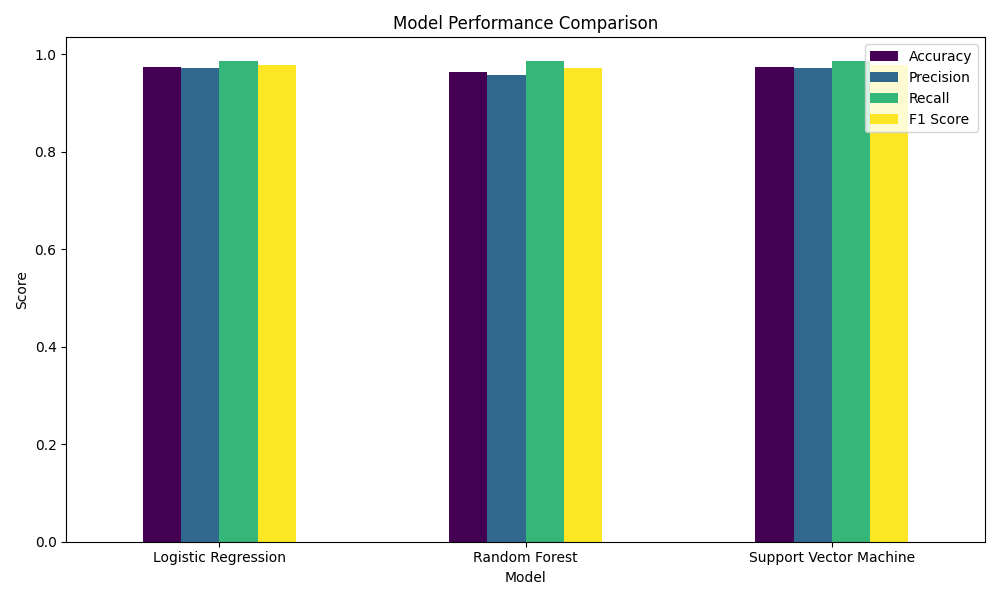
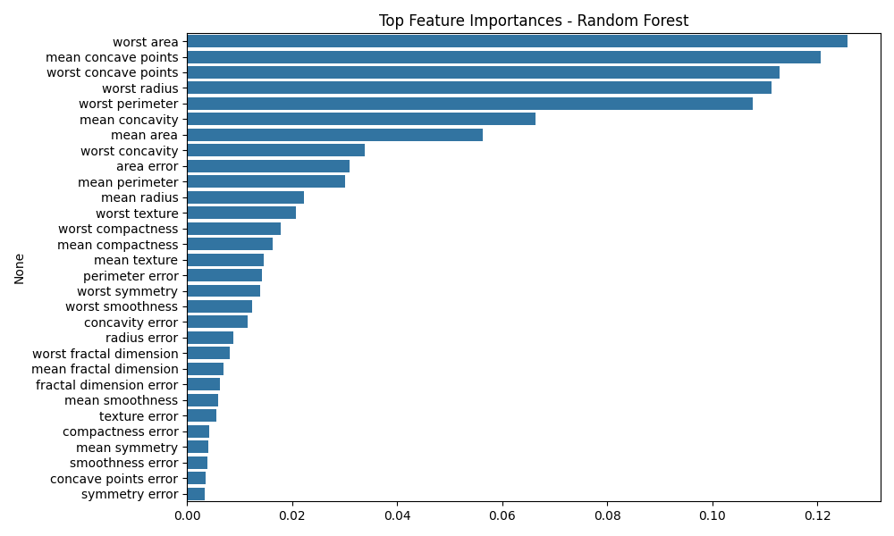
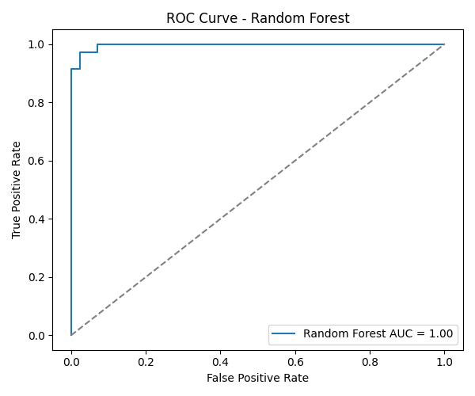

# CSI-Assignment---Week-6


# 🚀 Model Evaluation & Hyperparameter Tuning  
> _Celebal Technologies Summer Internship 2025 – Week 6 Assignment by Debargha Karmakar_

---

## 🧠 Overview

This project focuses on building, evaluating, and optimizing machine learning models for binary classification using the **Breast Cancer Wisconsin Diagnostic Dataset**. The models are not only trained but also fine-tuned using **advanced hyperparameter tuning techniques** to extract their best possible performance.

This isn't just about code — it's about **clarity**, **impact**, and **insight**.

---

## 🎯 Objective

- Train multiple machine learning models.
- Evaluate them using diverse performance metrics.
- Tune them with **GridSearchCV** and **RandomizedSearchCV**.
- Visualize results for clear interpretation.
- Identify and recommend the best-performing model.

> 💡 The problem we’re solving is not academic — it’s real. Early diagnosis of breast cancer saves lives. Every model trained in this notebook carries that weight.

---

## 📦 Technologies Used

| Tool/Library          | Purpose                          |
|----------------------|----------------------------------|
| `Python`             | Core programming language        |
| `scikit-learn`       | Machine learning models          |
| `matplotlib` & `seaborn` | Visualizations               |
| `pandas`, `numpy`    | Data manipulation                |
| `GridSearchCV`       | Exhaustive hyperparameter tuning |
| `RandomizedSearchCV` | Efficient hyperparameter tuning  |

---

## 📂 Project Structure
```
model-evaluation-hyperparameter-tuning/
│
├── main.py # Complete ML pipeline
├── README.md # Project documentation
├── outputs/ # Saved results & visualizations
│ ├── classification_report.txt
│ ├── confusion_matrix_lr.png
│ ├── confusion_matrix_rf.png
│ ├── confusion_matrix_svm.png
│ ├── feature_importance_rf.png
│ ├── model_comparison.png
│ ├── model_performance_summary.csv
│ └── roc_curve_rf.png
```

---

## 🔍 Models Trained

- ✅ Logistic Regression
- 🌲 Random Forest Classifier
- 💠 Support Vector Machine (SVM)

Each model was evaluated using:

- **Accuracy**
- **Precision**
- **Recall**
- **F1-Score**

And their performance was visualized through confusion matrices, ROC curves, and summary bar plots.

---

## 🧪 Hyperparameter Tuning

| Technique         | Applied To        | Purpose                            |
|------------------|-------------------|------------------------------------|
| `GridSearchCV`   | Random Forest     | Best parameters via grid search    |
| `RandomizedSearchCV` | SVM           | Quick scan of hyperparameter space |

---

## 📊 Visualizations

All visualizations are saved in the `Outputs/` folder.

### 📈 Model Comparison


### 🧬 Feature Importance (Random Forest)


### 🧪 ROC Curve (Random Forest)


### ✅ Confusion Matrices
Each model's confusion matrix is saved separately for clarity.

---

## 📁 Outputs Included

- `classification_report.txt` – Detailed reports for all models
- `model_performance_summary.csv` – Tabular comparison
- PNG plots of confusion matrices, ROC curve, model comparison, feature importance

---


## ⚙️ How to Run

1. Clone this repo:
   ```bash
   git clone https://github.com/yourusername/model-evaluation-hyperparameter-tuning.git
   cd model-evaluation-hyperparameter-tuning
